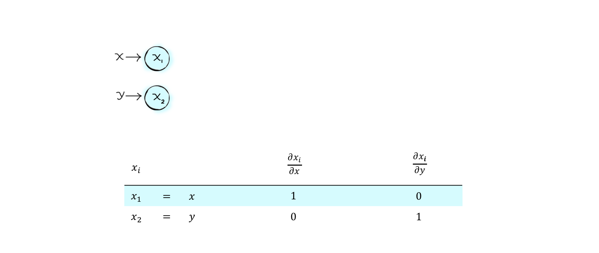
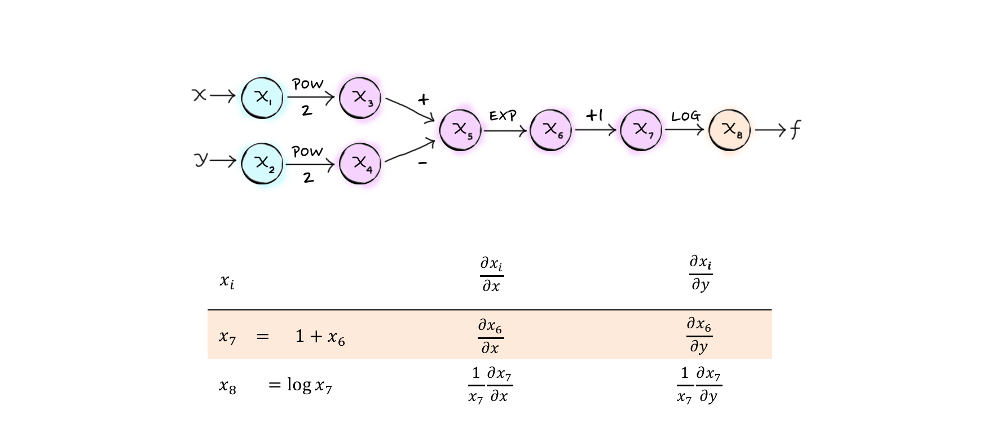

Background
==============

The underlying principle behind automatic differentiation is the chain rule. Any complex function whose derivative we would like to compute can be expressed as the composition of elementary functions and operations. By obeying properties of the chain rule in tracing how the elementary operations make up the final function, an accompanying derivative of the function can be computed.

There are two flavors of algorithm for implementing automatic differentiation: the forward mode and the reverse mode. Here we will focus on the forward mode, which means that derivatives are computed starting from the most primitive building block - the independent variables of the function - to the most complex: the function itself. Following is a simple example of how the forward mode may be used determine the derivative of

.. math::

   f(x,y) = \log \left[ 1 + \exp \left( x^2 - y^2 \right) \right]

We can visualize the process by constructing a computational graph.The first two nodes of our graph, :math:`x_1` and :math:`x_2`, take as input the independent variables of the function :math:`f`. Their gradients :math:`\left (\dfrac{\partial x_i}{\partial x},\dfrac{\partial x_i}{\partial y}\right)` have the seed values :math:`(1,0)` and :math:`(0,1)`, respectively.

Next, :math:`x_3` and :math:`x_4` are exponentiated to obtain :math:`x_1` and math:`x_2`, and their corresponding gradients are defined in terms of :math:`x_1` and :math:`x_2`, computed in the previous step.

.. image:: ../figs/cg2.png

:math:`x_5` is composed by a subtraction operation between :math:`x_3` and :math:`x_4`, and followed by raising $e$ to :math:`x_5` to obtain :math:`x_6`.

Following through the remaining operations, we arrive at $x_8$, which corresponds to the final function :math:`f`:

This procedure also extends naturally to vector-valued functions, for which the computational graph would end with multiple output nodes.

