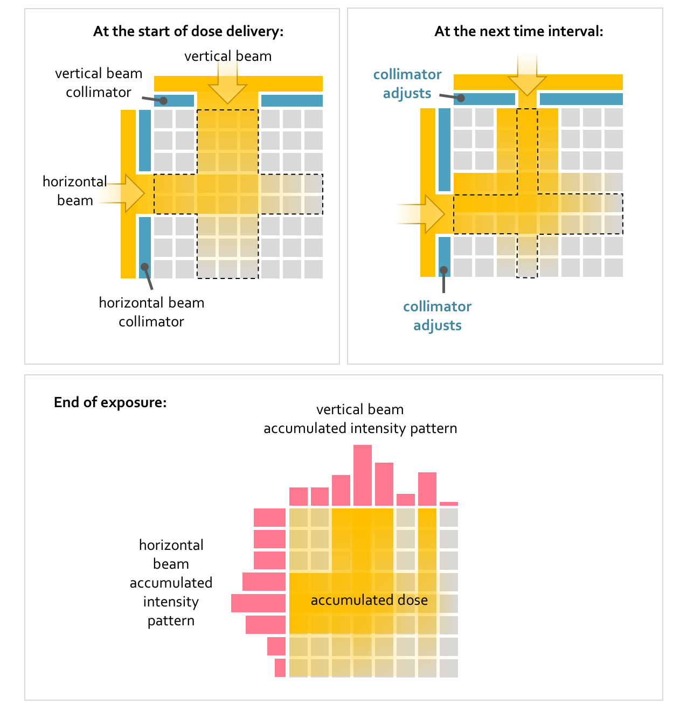
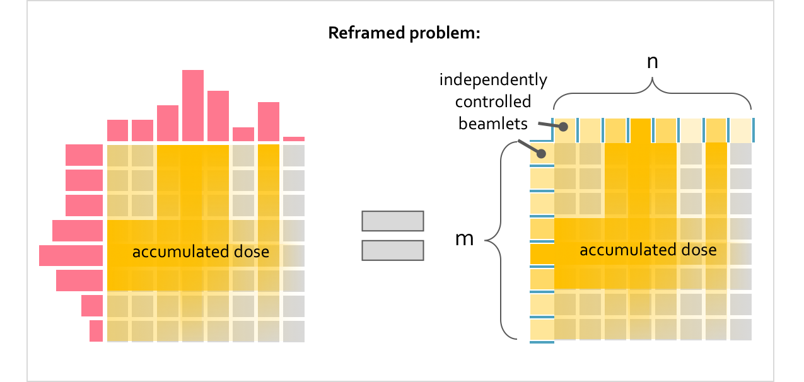

Basics of IMRT
==============

Intensity Modulated Radiation Therapy (IMRT) is a technique for optimizing radiation dose delivery for cancer treatment, and has played a significant part in the development of radiation oncology [Cho18]_. A key objective of radiation therapy is to precisely irradiate a defined tumor region whilst minimising radiation exposure to adjacent organs and healthy tissue.  IMRT addresses this goal through a process known as inverse planning. In inverse planning, the exposure time to one or more irradiation beams is determined through optimization given a target dose distribution across a volume and the beam source intensity. In addition, the irradiated regions are modulated through the adjustment of beam collimators, devices which limit and control the transmitted radiation [Boye02]_. Thus, the optimization problem involves determining the exposure time for each beam, as well as designing the sequence of collimator apertures over the course of exposure time in order to optimally irradiate a volume.

The figure below illustrates a small example of a rectangular grid irradiated by a horizontal and a vertical beam. Each beam is equipped with a collimator which is automated to adjust according to a specified sequence, thereby allowing for a non-uniform accumulated dose distribution to be delivered to the region.

Rather than optimize the collimator positions and exposure times directly, in IMRT the optimization problem is reframed in the following way, as illustrated below. Each beam is considered as subdivided into several, individually controlled beamlets according to the resolution of the grid. The intensities of the individual beamlets are optimized to deliver as close to the target dose distribution as possible. Then, the exposure time to each beam and the sequence of collimator positions can be analytically computed given the single source intensity of the true horizontal and vertical irradiation beams.

The optimization problem in this example considers

.. math::

   \begin{array}{l}
   m+n \text{ beamlets} \\
   m\times{n} \text{ target doses} \\
   \end{array}

The beamlet intensity varies with depth through the region as

.. math::

   I(x) = I_o e^{-\mu{x}}

where :math:`\mu` is an attenuation coefficient specific to the type of tissue [TaKB15]_. The delivered dose at each grid position can then be expressed as follows:

.. math::

   D_{(m\times{n})\times{1}} = A_{(m\times{n})\times{(m+n)}}B_{(m+n)\times{1}}

where :math:`A` is an attenuation matrix mapping the beamlet source intensities :math:`B` to the delivered doses :math:`D`. The attenuation matrix is composed of the attenuation factors :math:`e^{-\mu{x}}` corresponding to each beamlet at each grid position.

The task of finding the optimal beamlet source intensities is formulated as the minimization of a cost function :math:`C`. In our example, the most general cost function has the following contributions:

.. math::

   C = \sum_{i=1}^{m\times{n}} \left[ \left( d_i - d_i^{target} \right)^2 + \sigma\left( d_i - d_i^{max} \right) + \sigma\left( d_i^{min} - d_i \right)\right] + \sum_{j=1}^{m+n} \sigma\left( -b_j \right)

where :math:`d_i \in D` and :math:`b_j \in B`. :math:`\sigma` is the logistic function, used as a continuous penalty function to enforce constraints such as that the delivered dose remain within bounds :math:`D^{min}` and :math:`D^{max}`, as well as that the beam intensities remain positive.

Once an optimal set of beamlet sources is found, the corresponding collimator aperture sequences and beam exposure times which most closely agree with the reframed problem solution can be determined analytically as detailed in [Boye02]_; this is achieved by sequentially aligning the left collimator position with positive steps (gradients) in the beamlet intensity pattern, and the right collimator position with negative steps (gradients) in the intensity pattern.

The next section highlights the optimization routine implemented with ``gradpy``, which allows for simple construction of cost functions as described above. The last section features example demos of our simple therapy planner implementation.

.. rubric:: References

.. [Cho18] Cho, Byungchul. "Intensity-modulated radiation therapy: a review with a physics perspective." *Radiation oncology journal* 36.1 (2018): 1.

.. [Boye02] Boyer, Arthur L. "The physics of intensity-modulated radiation therapy." *Physics Today* 55.9 (2002): 38-44.

.. [TaKB15] Tanir, Ayse Gunes, Fatma Serap Ketenci, and Mustafa Hicabi Bolukdemir. "Usage of attenuation coefficients of some tissue-equivalent materials." Turkish Journal of Physics 39.1 (2015): 69-74.